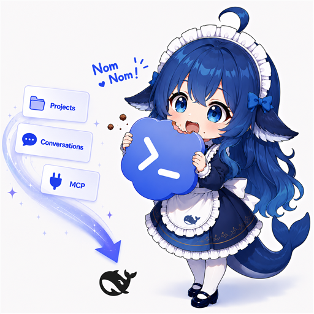

# dsh-codex-migrate 发布指南(详细版)

> 已验证:包名 `dsh-codex-migrate` 在 npm registry 上未被占用;npm registry 网络可达。
> 本机环境:Windows、node v24、npm.cmd 可用。

## 一、前置准备(一次性)

### 1. npm 账号
- 没有则到 https://www.npmjs.com/signup 注册(免费)
- 本地登录(在**普通终端**执行,沙箱内可能无法交互):
  ```bash
  npm login
  # 输入用户名/密码/邮箱;或使用 Access Token:
  npm login --auth-type=legacy
  ```
  或免交互:https://www.npmjs.com/settings/<你>/tokens 生成 "Automation" token:
  ```bash
  npm config set //registry.npmjs.org/:_authToken=<token>
  ```

### 2. GitHub 仓库(强烈建议,市场收录与宣传图托管都依赖)
- 建仓库 `dsh-codex-migrate`,把 `D:\deepseek-work\dsh-codex-migrate\` 整个推上去:
  ```bash
  cd D:\deepseek-work\dsh-codex-migrate
  git init
  git add .
  git commit -m "dsh-codex-migrate 0.1.0: Codex → DSH migration plugin"
  git remote add origin https://github.com/<你的账号>/dsh-codex-migrate.git
  git push -u origin main
  ```
- 推送前建议加 `.gitignore`(排除 `.smoke-out/`、`node_modules/`、`.npm-cache/`)
- 推完后在 package.json 补 `repository` 字段(提升 npm 页面可信度):
  ```json
  "repository": {
    "type": "git",
    "url": "git+https://github.com/<你的账号>/dsh-codex-migrate.git"
  }
  ```

### 3. 宣传图
- 把图(建议 PNG/WebP,宽约 1280px)放进仓库,如 `images/banner.png`、`images/screenshot-settings.png`
- README 顶部引用(相对路径,GitHub 可渲染):
  ```markdown
  
  ```
- **npm 页面**不渲染相对路径图片,README 里图片须用绝对 URL:
  ```markdown
  
  ```
  两处都要能显示,可同时保留两行(一行给 GitHub 用户看,URL 用 raw 形式最通用,推荐统一用 raw URL)。

## 二、发布到 npm

```bash
cd D:\deepseek-work\dsh-codex-migrate
npm run build            # 重新打包 client(保证与源码一致)
npm pack --dry-run       # 复核 10 个文件、lib/logic.js 与 lib/i18n.js 在内
npm publish --access public
```

- 发布后验证:
  ```bash
  npm view dsh-codex-migrate version dist.tarball
  ```
- **npm 侧 "topic" = package.json 的 `keywords`**(新版 npm 网站没有 Package Topics 编辑入口;
  旧版 UI 的记忆不可靠)。要把 `dsh-plugin` 显示为 topic:keywords 数组加 `"dsh-plugin"` 后发新版本。
- **市场聚合用的是 GitHub topic**:建好仓库后在仓库主页 About 区(⚙)添加 GitHub topic `dsh-plugin`,
  awesome-deepseek-harness 聚合 dsh-external/hub + 公共 dsh-plugin topic 的仓库。

## 三、用户侧安装验证(可选但推荐)

发布后在**另一台机器或全新 profile**验证一次真实安装路径:
```bash
dsh plugin --profile web add dsh-codex-migrate
# 或独立 profile 隔离验证:
dsh plugin --profile codex-test add dsh-codex-migrate
```
重启后确认:设置 → Codex Migration 面板、`codex_sync` 工具、同步导入与发消息。

## 四、市场收录(按入口逐个操作)

### 1. awesome-deepseek-harness(0xsline)
- 聚合 dsh-external/hub 与公共 `dsh-plugin` topic → **加 topic 后即可能被自动聚合**
- 精选列表提 PR:fork → 按 README 格式在插件分类下加一条(名称、一句话描述、npm/GitHub 链接、可选截图),PR 描述里附宣传图

### 2. awesome-dsh-plugin(awesome-dsh-plugin)
- 同样 fork + PR 加条目;该列表有 badge 机制,格式见其 README/CONTRIBUTING

### 3. dsh-market(dsh-market)
- 可视化市场;README 称 curated entries + npm mapping,CI 每日刷新
- 【待确认】收录入口:发布前到该仓库看 CONTRIBUTING/README 的提交方式(可能需要在其数据文件加条目或提 PR);若无人工入口则依赖 npm 映射自动出现

### 4. vlln/plugin-registry(可选)
- 若其 registry 清单支持外部插件条目,按其格式提 PR

> 每个仓库的**精确字段格式**以其当前 CONTRIBUTING/README 为准,提交前先读一遍。

## 五、后续版本升级流程

```bash
# 1. 改代码,更新 version(0.1.1 / 0.2.0,遵循 semver)
# 2. 重建 + 发布
npm run build
npm publish --access public
# 3. 用户侧升级:
dsh plugin --profile web update dsh-codex-migrate
```

- 修复了 bug 记得在 README 或 CHANGELOG 记录;市场列表条目不用每次更新(版本号由 npm 提供)

## 六、重命名操作规范(血泪教训)

插件改名时,**以下 6 处必须同时改名**,任何遗漏都会导致 404 或双实例:

1. 插件目录名(如 `node_modules/dsh-codex-migrate`)
2. `package.json` 的 `name`
3. `cordis.patch.yml` 的 `name`(行 `id` 建议同步改)
4. `lib/client.js` 的 `window.__ModuleLoader__.load({ id })`(由 `scripts/build-client.js` 生成)
5. web profile 的 `dsh.profile.bundles` 列表中的名字
6. client Remote contribution 的 `package` 与 descriptor `id` 前缀(`src/client/index.js`)

**BOM 陷阱**:用 PowerShell `Set-Content -Encoding UTF8` 写 JSON 会写入 UTF-8 BOM(PS 5.1),
DSH 读配置会失败。写任何 `.json`/`.yml` 一律用:
- Node:`writeFileSync(path, content)`(默认无 BOM)
- PowerShell:`[System.IO.File]::WriteAllText($path, $text, [System.Text.UTF8Encoding]::new($false))`
- 改完必须重启 DSH(运行中的进程缓存旧名字,浏览器还会请求旧资源路径返回 404)

改名后的验证顺序:重启 DSH → 浏览器 Ctrl+F5 → 检查 `/plugins/<新名>/client.js` 返回 200
→ 设置面板出现 → 工具/remote 正常。

## 七、常见坑

| 坑 | 说明 |
| --- | --- |
| 设置面板条目"消失" | **先关掉所有旧标签页再查!** client 侧 Inspect 查询由"最先响应的页面"回答,改名/重建前打开的旧标签页会一直抢答并返回陈旧树(没有新插件的条目),造成"作用域隔离"假象。诊断法:给每个页面打 `performance.timeOrigin` 标记做逐页采样 |
| client 改动不生效 | 必须 `npm run build` 重新生成 lib/client.js 再发布 |
| files 缺文件 | 已修:`files: ["lib/", ...]`;改代码后 `npm pack --dry-run` 复核 |
| peer 依赖版本 | 与 DSH 部署的 @deepseek-ai 包版本对齐(当前 ^0.1.0-rc.6) |
| 发布 403 | 未登录或 token 无 publish 权限;用 Automation token |
| 包名冲突 | 已确认 dsh-codex-migrate 可用;若日后被抢注可加 scope(@<你>/dsh-codex-migrate) |
